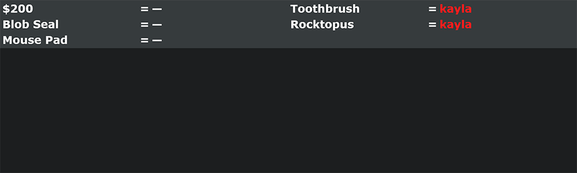

# Battle of the Bois Widget

This widget simple displays Battle of the Bois gift information in a method that's easy to add to OBS. This should allow authorized users to browse to `http://<domain>/botb/console/` and change values while `http://<domain>/botb/widget` will always update from those values.

This is an example of the widget in it's initial stable form.



## Production Machine Setup

Here is some random commands that I know need to be run to run the setup machine. This should be done after the production machine has finished updating and an appropriate system user made for running the server.

```bash
# Add following keys to the bash rc file for the user that will be running the server
export DJANGO_DEBUG=
export DJANGO_SECRET_KEY=
export DJANGO_STATIC_URL=
export NPM_BIN_PATH=
# These values change depending on the final location of the server


# To install pip dependencies for deployment
pipenv install --deploy


# Installing Tailwind
############################################
sudo apt install nodejs npm
npm install tailwind-css

# Collect static files
# https://docs.djangoproject.com/en/2.0/howto/static-files/deployment/#serving-static-files-in-production
# python manage.py collectstatic
# This isn't done on the production machine. As of now, daphne doesn't host static files off the same machine. A package called [whitenoise](https://whitenoise.evans.io/en/stable/index.html) should be able to help with that, but for now I'm just hosting static files of an S3 bucket.
```

This is by no means a final list and probably needs to be more well thought-out for future widgets.